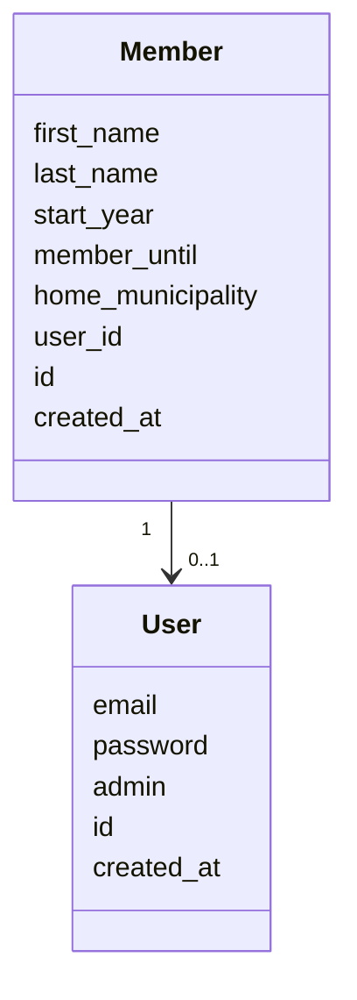

# Arkkitehtuurikuvaus

## Rakenne

Ohjelman rakenne noudattelee kolmitasoista kerrosarkkitehtuuria, ja koodin pakkausrakenne on seuraava:

Pakkaus _ui_ sisältää käyttöliittymästä, _services_ sovelluslogiikasta ja _repositories_ tietojen pysyväistallennuksesta vastaavan koodin. Pakkaus _entities_ sisältää luokkia, jotka kuvastavat sovelluksen käyttämiä tietokohteita.

## Käyttöliittymä

TBD

## Sovelluslogiikka

Sovelluksen loogisen tietomallin muodostavat luokat [User](../src/entities/user.py) ja [Member](../src/entities/member.py), jotka kuvaavat käyttäjiä ja rekisterin jäseniä. Kaikki käyttäjät ovat jäseniä, mutta kaikki jäsenet eivät ole käyttäjiä. Admin voi luoda uusia jäseniä, ja kaikki voivat muokata omia tietojaan.

Toiminnallisista kokonaisuuksista vastaa luokkan [RegistryService](../src/services/registry_service.py) ainoa olio. Luokka tarjoaa kaikille käyttöliittymän toiminnoille omat metodit.

_TodoService_ pääsee käsiksi käyttäjiin ja todoihin tietojen tallennuksesta vastaavan pakkauksessa _repositories_ sijaitsevien luokkien [MemberRepository](../src/db/member_repository.py) ja [UserRepository](../src/db/user_repository.py) kautta. Luokkien toteutuksen [injektoidaan](https://en.wikipedia.org/wiki/Dependency_injection) sovelluslogiikalle konstruktorikutsun yhteydessä.

Ohjelman osien suhdetta kuvaava luokka/pakkauskaavio:

## Tietojen pysyväistallennus

Pakkauksen _repositories_ luokat `MemberRepository` ja `UserRepository` huolehtivat tietojen tallettamisesta PostgreSQL-tietokantaan,

Luokat noudattavat [Repository](https://en.wikipedia.org/wiki/Data_access_object) -suunnittelumallia ja ne on tarvittaessa mahdollista korvata uusilla toteutuksilla, jos sovelluksen datan talletustapaa päätetään vaihtaa.

## Päätoiminnallisuudet

TBD

## Ohjelman rakenteeseen jääneet heikkoudet

TBD