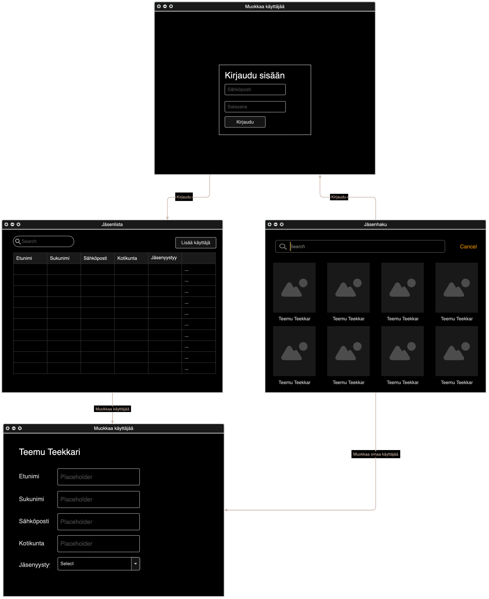

# Vaatimusmäärittely

## Sovelluksen tarkoitus

Sovelluksen avulla käyttäjä pystyy hallinnoimaan yhdistyksen jäsenrekisteriä. Sovelluksessa on mahdollista lisätä, poistaa ja muokata jäseniä. Jäseniä voi hakea eri hakuehdoilla. Sovellus tallentaa jäsenet tietokantaan.

## Käyttäjät

Sovelluksessa on kaksi käyttäjäroolia: *ylläpitäjä* ja *peruskäyttäjä*. Ylläpitäjä voi lisätä ja poistaa käyttäjiä sekä muokata käyttäjien tietoja. Peruskäyttäjä voi hakea jäseniä ja muokata omia tietojaan.

## Käyttöliittymäluonnos

Sovellus aukeaa persunäkymään, mistä pystyy hakemaan jäseniä. Ylläpitäjä voi kirjautua sisään jolloin pääsee ylläpitäjänäkymään, jossa voi lisätä, poistaa ja muokata jäseniä.

## Perusversion tarjoama toiminnallisuus

## Ennen kirjautumista

- Käyttäjä voi kirjautua sisään pääkäyttäjänä
- Käyttjä voi hakea jäseniä eri hakuehdoilla

## Kirjautumisen jälkeen

- Jäsenhallinta (pääkäyttäjä)
  - Jäsenen lisääminen
  - Jäsenen poistaminen
  - Jäsenen tietojen muokkaaminen
  - Jäsenten haku eri hakuehdoilla
  - Jäsenten listaus eri järjestyksissä
- Omien kirjautumistietojen muokkaaminen
- Uloskirjautuminen

## Jatkokehitysideoita

- Jäsenten importtaus tiedostosta
- Jäsenten exporttaus tiedostoon
- Jäsenhakemus -lomake
- Laajemmat tiedot jäsenistä enemmän matrikkelin tapaan
- Jäsenmaksujen hallinta
- Ohjelman vieminen verkkosovellukseksi
- Tilastoja jäsenistä
- Kirjautuminen peruskäyttäjänä
  
