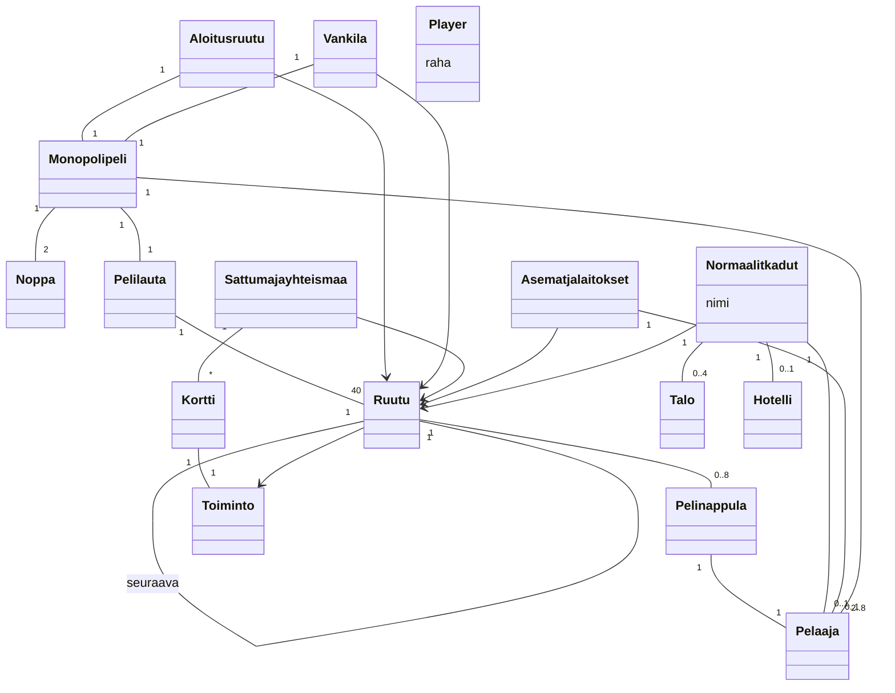

# Monopoli, luokkakaavio

```mermaid
 classDiagram
    Monopolipeli "1" -- "2" Noppa
    Monopolipeli "1" -- "1" Pelilauta
    Pelilauta "1" -- "40" Ruutu
    Ruutu "1" -- "1" Ruutu : seuraava
    Pelinappula "1" -- "1" Pelaaja
    Pelaaja "2..8" -- "1" Monopolipeli
    Ruutu "1" -- "0..8" Pelinappula
    Aloitusruutu --> Ruutu
    Vankila --> Ruutu
    Aloitusruutu "1" -- "1" Monopolipeli
    Vankila "1" -- "1" Monopolipeli
    Sattuma ja yhteismaa --> Ruutu
    Sattuma ja yhteismaa "1" -- "*" Kortti
    Kortti "1" -- "1" Toiminto
    Asemat ja laitokset --> Ruutu
    Normaalit kadut --> Ruutu
    Normaalit kadut "1" -- "0..4" Talo
    Normaalit kadut "1" -- "0..1" Hotelli
    Normaalit kadut "1" -- "0..1" Pelaaja
    Asemat ja laitokset "1" -- "0..1" Pelaaja
    Ruutu --> Toiminto
    class Player {
      raha
    }
    class Normaalit kadut {
      nimi
    }
```
