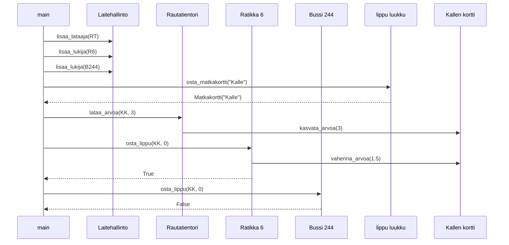

# HSL, sekvenssikaavio

```mermaid
sequenceDiagram
    participant M as main
    participant H as Laitehallinto
    participant RT as Rautatientori
    participant R6 as Ratikka 6
    participant B244 as Bussi 244
    participant K as lippu luukku
    participant KK as Kallen kortti
    M->>H: lisaa_lataaja(RT)
    M->>H: lisaa_lukija(R6)
    M->>H: lisaa_lukija(B244)
    M->>K: osta_matkakortti("Kalle")
    K-->>M: Matkakortti("Kalle")
    M->>RT: lataa_arvoa(KK, 3)
    RT->>KK: kasvata_arvoa(3)
    M->>R6: osta_lippu(KK, 0)
    R6->> KK: vahenna_arvoa(1.5)
    R6-->>M: True
    M->>B244: osta_lippu(KK, 0)
    B244-->> M: False
```
